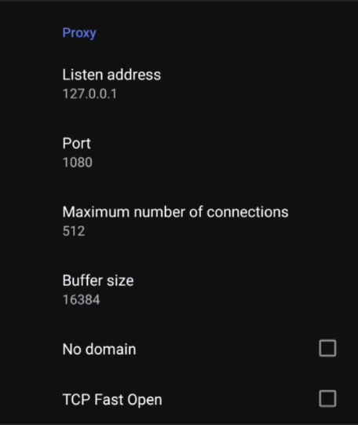
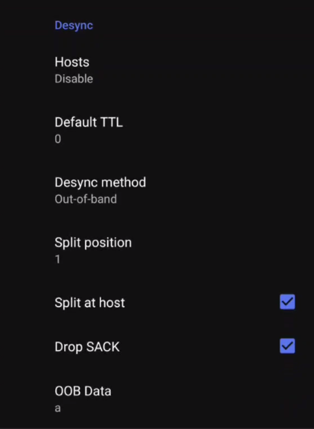

# YT-DS-UNLOCK

## Disclaimer
Всё нижеописанное применяйте на свой страх и риск

## Оглавление
1. [Android](#Android)
3. [Windows](#Windows)
4. [Linux](#Linux)
5. [IPhone](#IPhone)

## Android
Скачиваем и устанавливаем ByeDpiAndroid, всё будет завязано именно на нём  
https://github.com/dovecoteescapee/ByeDPIAndroid/releases  

### Первичная настройка
1. Заходим в настройки (значек шестерёнок)
2. Ставим Mode -> VPN
3. DNS -> 8.8.8.8
4. IPv6 -> OFF

### Youtube
5. Use command line settings -> ON
6. Command line editor
7. Command line arguments
8. Вставляем один из следующих вариантов:
   - ```
     -s1 -q1 -Y -Ar -s5 -o1+s -At -f-1 -r1+s -As -s1 -o1 +s -s-1 -An -b+500
     ```
   - ```
     -o1 -o25+s -T3 -At
     ```
   - свой набор аргументов исходя из [предложенных](https://github.com/hufrea/byedpi/blob/main/README.md)
9. Нажимаем `Connect`

### Discord
5. Use command line settings -> OFF
6. UI editor
7. Ставим настройки как показано на снимках:  
   

## Windows
Самый легкий метод описан тут  
https://github.com/Flowseal/zapret-discord-youtube

## Linux
### Youtube
Скачиваем следующий репозиторий 
```bash
git clone https://github.com/hufrea/byedpi.git
```
Дальше собираем с помощью `make`  
Запускаем с помощью:  
```bash
./ciadpi --ip 127.0.0.1 --port 1080 -o1 -o25+s -T3 -At
```
или
```bash
./ciadpi --ip 127.0.0.1 --port 1080 -s1 -q1 -Y -Ar -s5 -o1+s -At -f-1 -r1+s -As -s1 -o1 +s -s-1 -An -b+500
```
(в случае, если не сработает, то нужно либо найти другие варианты арументов, либо [разобраться](https://github.com/hufrea/byedpi/blob/main/README.md) в работе DPI и аргументов и собрать собственный набор)  
  
Далее настраиваем прокси SOCS5 (только SOCS5, остальное не трогаем) в браузере или прямо в ОС на указанные в аргументах ip и port

### Discord
Всё уже описано в данном репозитории  
https://github.com/maximilionus/byedpictl  
  
Если не сработает, то возможно найдётся ответ в следующей ссылке  
https://github.com/hufrea/byedpi/discussions/195

## IPhone
Арендуем сервер в другой стране, например на hostvds.com за 1 доллар, нам понадобится адрес сервера и root пароль  
Теперь что нужно сделать на IPhone:  

Скачать эту прогу в аппстор:   https://apps.apple.com/ru/app/http-injector/id1659992827  

Дальше её настройка:  

Нажимаешь на V2Ray/Xray кнопку, она под кнопкой start  

Дальше на текст под Tunnel Type (V2Ray/X-ray) и выбираешь Secure shell (ssh)  

Дальше на текст под Connect From (TLS/SSL (Stunnel) и выбираешь None (Direct)  

Дальше нажимаешь Save  

Теперь на шестерёнку сверху  

Потом на Secure Shell (SSH)  

Дальше на SSH Host и вводишь: адрес сервера (четыре числа от 0 до 255 через точку)

Дальше на SSH Port и вводишь: 22

Дальше на Username и вводишь: root

Дальше на Password/Passphrase и вводишь: пароль от root

Теперь нажимает старт в главном окне и даём разрешение на подключение 